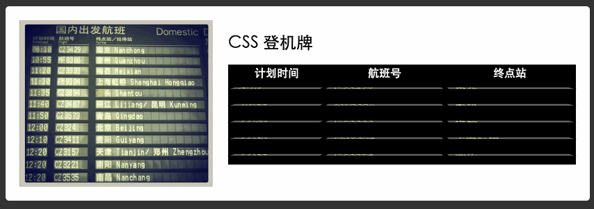
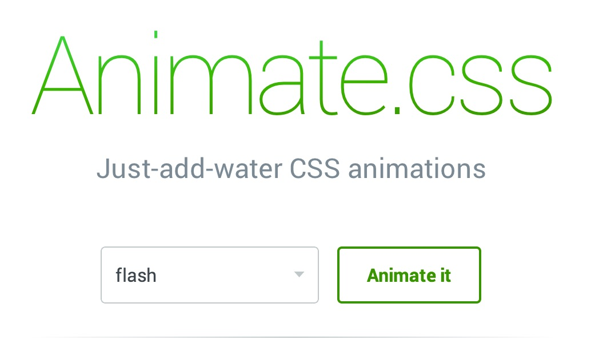

# CSS3动画

实际上上一篇的过渡与变换中，`transition`便是CSS动画的组成部分之一。然而CSS中还有另外一个专属的动画属性`animation`，顾名思义它便是处理动画的。本文依旧不打算详细的描述这个这个特性的每个属性，但是我们可以通过一个简单的demo来快速的探索一下它的用法。

先来看一个效果：



好闪，但是这可是用CSS实现的哦。

在上一篇介绍中，使用`transition`结合`transform`变换也可以实现翻转。但是，使用这两个属性没办法实现连续的反转。因此，便有了动画的需求，幸运的是CSS3中提供了`Animation`模块 - `animation`。

先来看一下使用`animation`都能干些啥：

- `[ animation-name ]`：检索或设置对象所应用的动画名称
- `[ animation-duration ]`：检索或设置对象动画的持续时间
- `[ animation-timing-function ]`：检索或设置对象动画的过渡类型
- `[ animation-delay ]`：检索或设置对象动画延迟的时间
- `[ animation-iteration-count ]`：检索或设置对象动画的循环次数
- `[ animation-direction ]`：检索或设置对象动画在循环中是否反向运动
- `[ animation-play-state ]`：检索或设置对象动画的状态。w3c正考虑是否将该属性移除，因为动画的状态可以通过其它的方式实现，比如重设样式

那么对于上面的登机牌翻转效果，我们只需借鉴`animation`中指定动画循环的次数为永久循环即可：

```css
animation: revolving 1s infinite;
```

然而上面列出的都只是`animation`属性所支持的属性设置选项，并没有列出动画的展示形式。事实上，这个效果是由`animation-name`属性指定的名称实现的。

在实现这个指定的动画时，我们需要使用`keyframes`关键字来定义上述效果中的`revolving`效果：

```css
@-webkit-keyframes revolving{
	0%,50%{
		-webkit-transform: perspective(700px) rotateX(90deg);
	}
	75%{
		-webkit-transform: perspective(700px) rotateX(0deg);
	}
	100%{
		-webkit-transform: perspective(700px) rotateX(-90deg);

	}
}
```

在这段代码中，使用`transform`特性指定了翻转效果中几个不同阶段的效果，然后使用`infinite`关键字指定这个效果无限次播放。

至此，一个航站楼登机牌的效果便实现了。

- [登机牌效果演示demo](http://pigrun.github.io/1st_run/demos/bobb/card/demo.html)

最后，本文只介绍了使用CSS的`animation`便可以实现一些炫酷的效果。而在实际工作中，借助这个能力，我们还可以实现更多增强性的动画为用户提供更好的体验。

这不，国外就有人专门整理收集了常见的动画效果：



- [Animation.css](http://daneden.github.io/animate.css/)