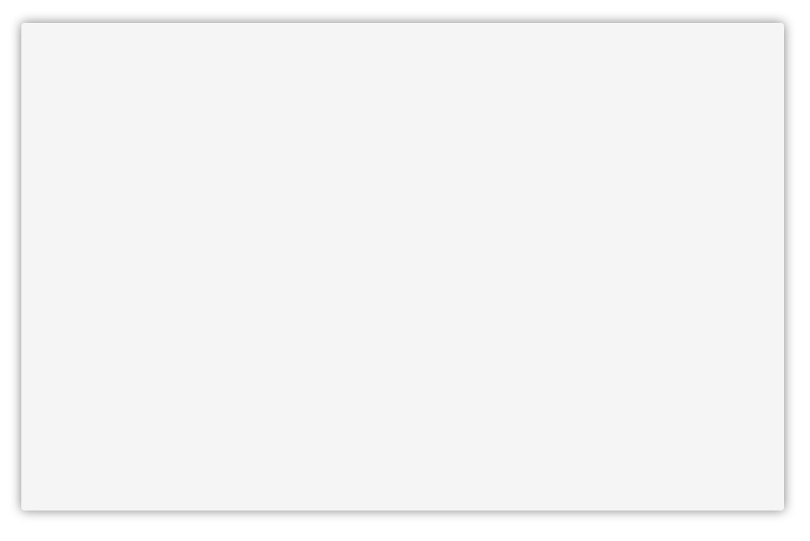
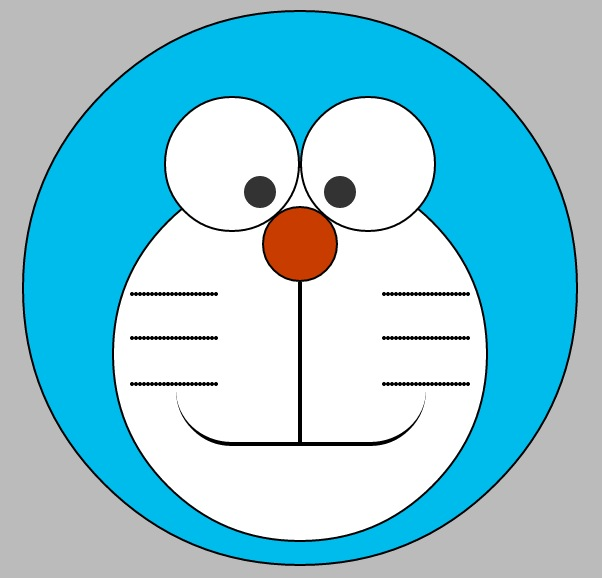

# CSS3之阴影使用

阴影，半透明的阴影可能对大多数的页面仔们来说见怪不怪。以往这些细节都会使用图片来实现。每每设计尺寸的修改，都需要重新打开PS/FW或者其他熟悉的工具默默的重新切割，一遍切割可能心里还在懊恼。

今天，这些都不再是什么大问题。


看看上面这个图形，换做以前，不用像这肯定又得切图了。但是，这里我们不介绍如何切片这么一张图片来使用。实际上这个效果是完全用CSS写出来的。不信？看看代码就知道了：

```css
.shadow {
    border-radius: 20px;
    box-shadow: 5px 5px 0 1px #666,10px 10px 0 1px #333,10px 10px 0 10px rgba(0,0,0,0.2),inset 0 0 10px 20px #A0B3D6,inset 0 0 5px 40px #CAD5EB;
}
```

是的，你没有看错这里我们并没有用图片。这里用的就是CSS3中带来的新属性`box-shadow`。

然而，对于大多数了解这个属性的人而言，可能都停留在这个印象中：



随手给盒子设置一个环绕的投影，然后根据自己的需求不断的调整投影的颜色，扩散范围。

实际上，`box-shadow`的能力远不只此。用一定的角度来说，单凭`box-shadow`可以完成很多诸如纹理背景，渐变叠加的效果。接下来，我们就简单的分析一下`box-shadow`的使用吧。

正如第一张图片中所示的，凭借`box-shadow`便可以绘制出多层投影的效果。但是，在此之前，先熟悉一下语法：

```shell
box-shadow：none | <shadow> [ , <shadow> ]*
<shadow> = inset? && [ <length>{2,4} && <color>? ]
```

一个普通的`box-shadow`书写格式如下：

```css
.box {
    box-shaodw: 0 1px 2px 4px rgba(0,0,0,0.5);
}
```

再看看上面的语法描述：

- `none`：无阴影
- `<length>`①：第1个长度值用来设置对象的阴影水平偏移值。可以为负值
- `<length>`②：第2个长度值用来设置对象的阴影垂直偏移值。可以为负值
- `<length>`③：如果提供了第3个长度值则用来设置对象的阴影模糊值。不允许负值
- `<length>`④：如果提供了第4个长度值则用来设置对象的阴影外延值。可以为负值
- `<color>`：设置对象的阴影的颜色。
- `inset`：设置对象的阴影类型为内阴影。该值为空时，则对象的阴影类型为外阴影

默认情况下，投影是向外扩散的，可以设置`inset`标记让它向内扩散。这对于简单的投影来说，的确没什么难度。

然而，`box-shadow`有一个在语法中没有描述的特性：它可以使用逗号分割的多组投影。第一张图片中的效果便是使用这一特性绘制出来的。

将代码拷贝到本地测试，可以发现：最外层的投影总是最先编写，而越靠近内层，编写的顺序越靠后。

了解到这一特性，便可以简单的使用`box-shadow`来实现更多丰富的效果了。下面来个实例：


这个按钮实现中就有一个细微的渐变和一个弱化的外部投影。而这个按钮的实现也正是使用`box-shadow`实现的：

```css
    background: #86BF6E;
    border: 1px solid #79B066;
    color: #fff;
    text-shadow: 0 1px 0 #81AF5F;
    box-shadow: 
        0px 1px 0px #ABD99C inset, 0px 10px 15px #96CF84 inset, /* 用两个向内扩散的投影实现高光+渐变 */
        0 1px 3px #D8E6D3, /* 然后向外扩散出一个细微的底部高光 */
        0 2px 6px rgba(0,0,0,.3); /* 最后来个弱化的暗色投影 */
```

如此，利用多层投影便很容易实现一个分层的渐变，然后合理的利用内外投影就可以很方便的实现简单的高光效果。借助于这些特性，普通的渐变，高光效果再也无需使用图片实现。

在上面的描述中，还有一个东西没有讲。那就是，投影的大小，使用`box-shadow`实现各种炫酷的效果时需要合理的控制投影的大小，扩散返回，模糊度。

最后，结合上述技巧和特性，一个CSS版的机器猫就这样诞生了：



这个实现中，仅仅用了一个元素。不妨思考一下如何实现？

[机器猫demo](http://pigrun.github.io/1st_run/demos/pping/pokonyan/pokonyan.html)