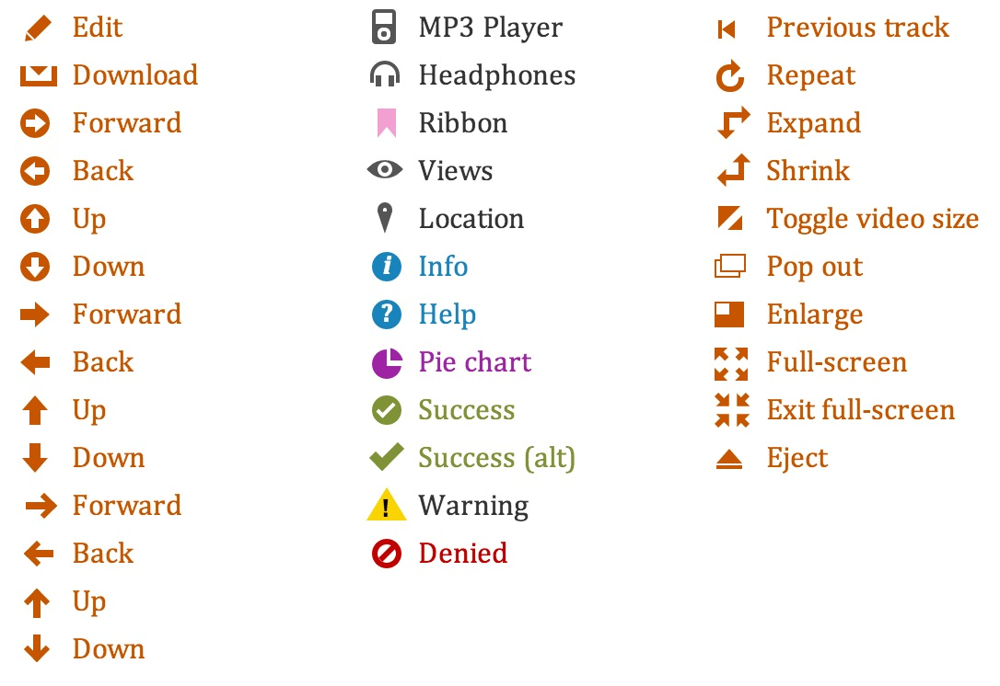
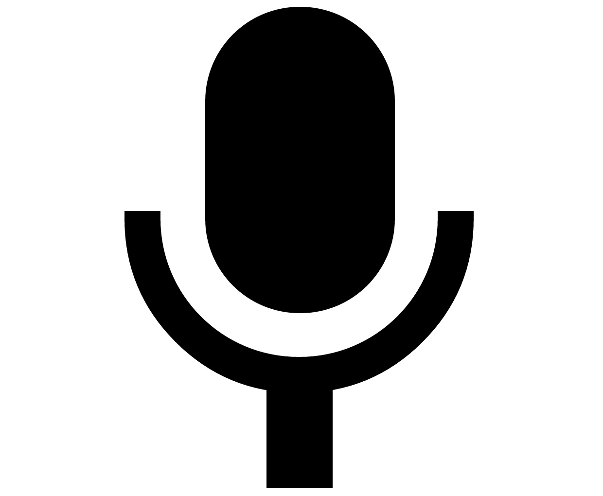
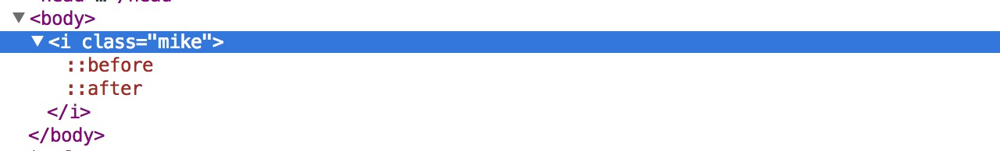
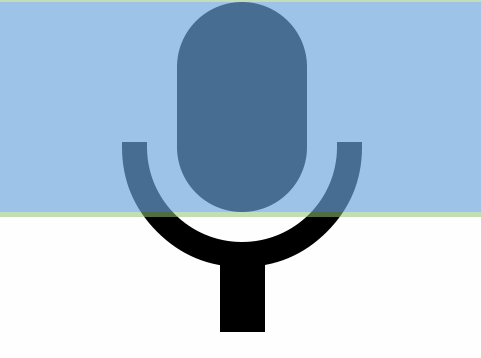

#CSS伪元素应用

常常，在编写Web页面的时候，由于一些精细的设计，在处理细节的时候我们不得不在处理某些需要边角料来修饰的效果时以修改`html`结构的方式来处理这些边角料，或者在处理一些简单的修饰元素时也总会习惯性的选择使用背景图片的方式来实现。

随着浏览器的跟进，CSS3的普及，**伪元素**应用越来越多。而使用**伪元素**，可以帮助我们实现很多技巧性的边角料。

那什么是伪元素呢？顾命思议，这个元素是*假*的，在Web页面的`html`中看不到，只有浏览器认识。使用伪元素时，通常都是结合CSS选择器使用，无需也没有办法单独描述它们，在浏览器渲染解析时，我们可以使用CSS样式来修饰这些伪元素，在浏览器中为它应用丰富的样式。

先来看一下这个[demo](http://nicolasgallagher.com/pure-css-gui-icons/demo/)，是不是很酷。这些都是用伪元素实现的。



CSS中主要有5个伪元素：

- `:after`
- `:before`
- `::first-letter`
- `::first-line`
- `::selection`

鉴于目前应用最广的`:before`和`:after`。本文试图探索用这两个伪元素实现一些炫技的效果。

以下图中的这个使用CSS绘制的麦克风为例，我们一起来看看如何使用伪元素。



嗯，有了这个图形。先来看看它的结构是什么样的：



是的，没有看错，一个空标签。But，注意这里的`::before`, `::after`，也就是我们前面提到的伪元素。

分析一下，通常绘制这么一个图形，要么使用背景图的方式，要么使用`svg`绘制，或者用`canvas`也行。但是，本文不讲述这些方式，回归自然，我们一起来探索一下如何用CSS实现。

通过使用Chrome开发这工具，我们可以发现，实际上它由三部分组成：



了解到它由三部分组成就好办了。首先我们的实现途中的*椭圆*，很简单，应用`border-radius`即可：

```css
.mike {
    position: relative;
    display: block;
    width: 260px;
    height: 420px;
    margin: 0 auto;
    background: #000;
    border-radius: 300px;
}
```

首先我们定义一个竖长方形，然后对它应用`border-radius`实现了如图所示的椭圆。

然而，不难发现，由于伪元素是没有*显性*的`html`结构的，是附加给CSS选择器之后应用样式的，所以我们得对这个椭圆应用**相对定位**，然后把伪元素挂上去的时候使用绝对定位的方式来定位剩下的部分。

而这里有还有两个部分，默认情况下，一个伪元素只能对应一个部分。很幸运，我们可以同时使用前面提到的`:before`和`:after`来处理剩下的两个部分。

先来把这两个部分挂上去：

```css
.mike:before, .mike:after {
    position: absolute;
    content: '';
}
```

好了，把伪元素挂上去。此时浏览器解析了伪元素，但是还没有样式。需要注意的是，这里的`content`属性是必要的，用于填充伪元素渲染时的内容；然而如果不设置它，伪元素便不会显示。但是这里显然不需要为这两个部分填充任何内容，为了显示这两个组成部分，可以对为`content`属性留空以便显示它们。

接下来，就是定义这两部分样式了：

```css
.mike:before {
    width: 90px;
    height: 180px;
    background: #000;
    left: 85px;
    bottom: -240px;
}
.mike:after {
    bottom: 0;
    left: 0;
    width: 380px;
    height: 200px;
    overflow: hidden;
    border: 50px solid #000;
    border-top: 0 none;
    border-radius: 0 0 280px 280px;
    bottom: -110px;
    left: -110px;
}
```

这里分别使用不同的伪元素控制两个不同的部分，然后对它们应用熟知的CSS样式，定位它们显示的位置即可。

至此，我们就简单的了解到如何使用伪元素了。是不是很好玩？

实际上，使用伪元素不光可以绘制出这个麦克风图形。还可以结合更多的CSS技术，作出更炫的效果。以下是这一期的一些demo示例：

- [使用CSS伪元素绘制太极](http://pigrun.github.io/1st_run/demos/pfhe/t.html)
- [使用CSS伪元素绘制简单的icon - v1](http://pigrun.github.io/1st_run/demos/json/css3-icon/icon.html)
- [使用CSS伪元素绘制简单的icon - v2](http://pigrun.github.io/1st_run/demos/pping/challenge/icon.html)
- [CSS3绘制麦克风示例](http://pigrun.github.io/1st_run/demos/pfhe/mike.html)

借助更多的CSS属性，还可以绘制出很多不同的形状。在新潮的浏览器中，可以为我们节省很多冗余的结构。
