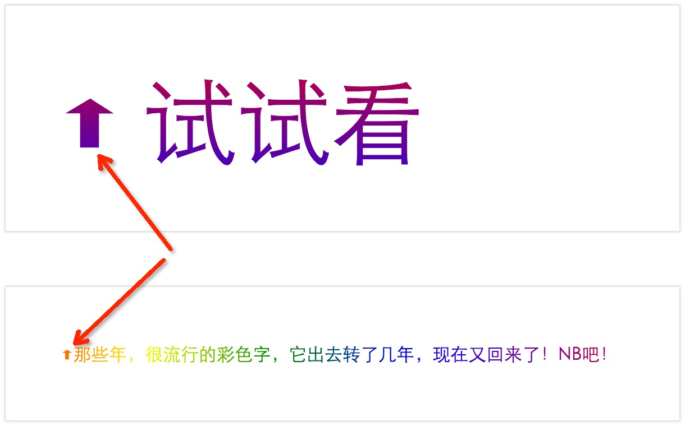
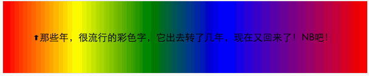

# 自定义字体图标与文本渐变

为追求更好的体验，无论是设计师还是前端开发工程师都在不断的探索。在充斥着大量内容文本的网页中，为追求更好的阅读体验，我们总在寻找最好的字体，以提供更舒服的阅读感觉，更美观的视觉感受。

随着CSS3的流行与应用，@font-face应用也在不断流行。这是CSS3中的一个模块。使用它可以将Web字体嵌入到网页中，从而在页面中除了使用常用的Web安全字体，我们能做更多的事情了。

或许很多人会纠结与这个东西是否新东西，IE党们会问：喂喂，它支持IE吗？恭喜你，IE很早就开始支持了。随着浏览器的不断升级，伴随着标准的推进。现在，几乎可以在全平台使用了。

如果你还想追求狂拽炫屌炸天的效果来“闪瞎”读者的眼睛，甚至还可以用CSS渐变结合CSS中背景切割的技术对文本做更多的控制，以让页面中的文本更多彩。

本文旨在探索如标题中所示的主题，用自定义字体的方式实现自定义图标，然后来个渐变让页面中的文本更多彩。

首先，咱们来看一个[demo](http://pigrun.github.io/1st_run/demos/rob/fonticon/index.html)。



如图所示的两个箭头就是自定义字体实现的，下面我们简单的分析一下，查看源代码你会发现这两个向上的箭头都是用一个`<i>`标签包裹着一个文本`A`

```html
<i>A</i>
```

然后，咱们来看看CSS代码：

```css
i {
    font-family: "icon";
    font-style: normal;
}
```

不用找了，不出意外你的机器里没这个字体。然后你可以尝试在Chrome开发这工具中先屏蔽这个字体，你会发现，这两个被包裹的文本`A`立马显形。嘿嘿，为毛会这样？

这便是自定义字体的精妙之处，其实这里在页面中，用到了前面提到的`@font-face`这个东西，也是使用它将字体嵌入到页面中的，看看代码：

```css
@font-face{
    font-family: "icon";
    src: url("icon.otf") format("opentype");
}
```

简单的介绍以下这两行代码，这里的`font-family`用来设置在页面中使用这个自定义字体时的平城；`src`属性用于设置自定义字体文件的路径（可以是相对路径，也可以是绝对路径），而后面的`format`用户指定字体格式，以便浏览器识别。

那么，至此我们大致了解到怎么用自定义字体的方式在页面中引入字体了。最后就剩下一个问题了：为什么文本`A`会变成一个如图所示的箭头呢？

这里我们还是简单的介绍以下如何实现的，其实所有的信息都保存在上面的`icon.otf`中，这个字体中实际上保存的是我们定义好的矢量图形信息。

首先通过毁图工具制作出这个矢量图形，也就是这里的**箭头**，然后用字体转换工具，将这个图形信息保存为字体。在保存的时候我们可以指定这个字体文件中这个特定的箭头对应的编码信息，为实现上面的效果，实际上这里我们就是将这个箭头对应的编码指定为`A`字符。

最后在页面中使用这个字体渲染文本`A`时，浏览器便会用这个字体中定义的图形。

大功告成。

> **提示**：字体的制作成本相对而言比较高；通常在一个字体中保存较多东西也会导致整个字体文件的增大，而在页面中引入字体时需要加载这个较大的文件，这会带来性能成本；再次，自定义字体还有跨域问题。
>
> 虽然，作为开发人员的我们要面对这几个问题；但是，随着互联网的不断发现，人们上网的速度越来越快，或者通过拆分文件等更多的手段这些都将不会是什么问题。
>
> 前面提到，自定义字体内保存的图形信息是矢量的，因而在使用的时候无需担心失真的问题。由于色彩的限制，对于单色的图标完全可以用自定义字体的方式实现。这样可以适配那些高清屏用户设备哦。。。

嗯，自定义字体图标的内容就介绍到这里。在上面的图片中，你一定发现了本文的另一个主题：**文本渐变**。对，你没看错。是不是很炫？你也想来一个？ok，很简单，看看怎么实现的。

打开浏览器，查看源代码。咦，代码好简单：

```css
#colortext {
    color: transparent;
    background: -webkit-linear-gradient(left,red,yellow,green,blue,purple,red);
    -webkit-background-clip: text;
}
```

真的很简单。先来看个演示：



首先，我们将文本设置为透明，这样最终文本跟背景色保持一致，就看不到文本了。

```css
color: transparent;
```

然后使用CSS3背景渐变，给背景设置一个大渐变：

```css
background: -webkit-linear-gradient(left,red,yellow,green,blue,purple,red);
```

这时候文本还是透明的，只能看到背景色。其实，最关键的就是上面所示的源码中的`background-clip`。

`background-clip`是CSS3中带来的属性，用来确定背景的裁剪区域，简单说就是控制元素背景的显示区域。其中它有一个可选的值：`text`，这个`text`用于将前景内容（也就是这里的文本）作为裁剪区域想歪裁剪，最后就达到了将背景色作为填充色的效果。正如demo中所示的渐变效果。

蠢蠢欲动？赶紧动手给你的博客填点彩色吧。:satisfied: