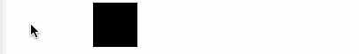

# CSS3过渡与变换

尽管屏幕技术，设备能力在不断更新，但是一直以来CSS都只有简单的双向状态，而无法使用渐进增强的效果。往往，很多优雅的切换效果我么都需要借助JavaScript或者诸如jQuery这类提供动画效果的库来实现过渡。

然而，大多数情况下我们都是使用大量的脚本代码实现这些原本很简单的效果。得益于CSS3的技术实现，现在我们可以使用CSS3中提供的过渡和变换实现很多渐进增强的效果。

假设，页面左侧有一个元素，我们希望鼠标移到这个严肃上是元素缓动右移`100px`，同时耗时`0.5s`。



```html
<div id="box"></div>
```

```css
#box {
	position: relative;
	left: 0;
	width: 50px;
	height: 50px;
	background: #000;
}
```

换做以前，这效果需要使用JavaScript定时器，使用一个偏移量，定时让这个元素向右偏移`100px`。但是，这里我们不讨论如何使用JavaScript代码实现这类效果，因为CSS为我们带来了`transition`属性，使用这个属性便可以很轻松实现这个效果。

对于上述效果，我们只需给`#box`元素添加一条属性即可：

```css
#box {
	/* ... */
	transition: left 0.5s ease-in;
}
/* 然后使用:hover伪类触发这个元素向右偏移 */
#box:hover {
	left: 100px;
}
```

这样，原本需要用JavaScript实现的效果简单的使用一个CSS属性即可实现。值得了解的是，`transition`的能力远不止于编写一个缓动向右移动的过渡效果。它还可以做更多的事情，接下来先让我们了解一下它的语法：

- transition：[ transition-property ] || [ transition-duration ] || [ transition-timing-function ] || [ transition-delay ]

- `[ transition-property ]`：检索或设置对象中的参与过渡的属性
- `[ transition-duration ]`：检索或设置对象过渡的持续时间
- `[ transition-timing-function ]`：检索或设置对象中过渡的动画类型
- `[ transition-delay ]`：检索或设置对象延迟过渡的时间

[详细语法参考](https://developer.mozilla.org/zh-CN/docs/CSS/Tutorials/Using_CSS_transitions)

正如语法中所示，我们可以指过渡时间在指定的时间内改变CSS属性，从而避免像传统的方式那样瞬间改变CSS属性值。因而我们可以使用这一属性，实现元素的缓动效果。

本期，在探索这个属性的应用时，凭借这个属性实现了一些好玩的增强的效果：

- [CSS鼠标滑入方向检测](http://pigrun.github.io/1st_run/demos/pfhe/css-hover-direction.html)
- [transition缓动效果](http://pigrun.github.io/1st_run/demos/pfhe/index.html)
- [可转动的太极图](http://pigrun.github.io/1st_run/demos/pfhe/t.html)

看过上面的demo还会发现使用`transition`属性实现了一些缓动倾斜，旋转的效果。这似乎并不是单纯的`transition`的能力。是的，这些效果是结合本文主题中的另外一个特性实现的 - **变换**。


有了变换我们无需再使用`gif`类的带动画效果的图片去展示一些炫酷的效果。在兼容标准的浏览器中单凭CSS也能实现。

接下还是先看看`trnasform`的能力：

- `matrix(<number>,<number>,<number>,<number>,<number>,<number>)`：以一个含六值的(a,b,c,d,e,f)变换矩阵的形式指定一个2D变换，相当于直接应用一个[a,b,c,d,e,f]变换矩阵
- `translate(<length>[, <length>])`：指定对象的2D translation（2D平移）。第一个参数对应X轴，第二个参数对应Y轴。如果第二个参数未提供，则默认值为0
- `translateX(<length>)`：指定对象X轴（水平方向）的平移
- `translateY(<length>)`：指定对象Y轴（垂直方向）的平移
- `rotate(<angle>)`：指定对象的2D rotation（2D旋转），需先有transform-origin属性的定义
- `scale(<number>[, <number>])`：指定对象的2D scale（2D缩放）。第一个参数对应X轴，第二个参数对应Y轴。如果第二个参数未提供，则默认取第一个参数的值
- `scaleX(<number>)`：指定对象X轴的（水平方向）缩放
- `scaleY(<number>)`：指定对象Y轴的（垂直方向）缩放
- `skew(<angle> [, <angle>])`：指定对象skew transformation（斜切扭曲）。第一个参数对应X轴，第二个参数对应Y轴。如果第二个参数未提供，则默认值为0

正如上述可选的`transform`属性所示，它的能力远不至于使用`rotate`让一个元素倾斜，旋转360度。

它还可以进行扭曲，缩放等等。甚至，使用`transform`属性还能实现3D效果：

- [CSS立方体](http://pigrun.github.io/1st_run/demos/pfhe/cube.html)
- [CSS折叠](http://pigrun.github.io/1st_run/demos/json/fold/fold.html)

在这篇文章中，我们并不试图分析这些属性的语法，旨在探索使用这些属性可以让我们编写的页面变得更炫酷。更多的特性，期待大家一起来挖掘。