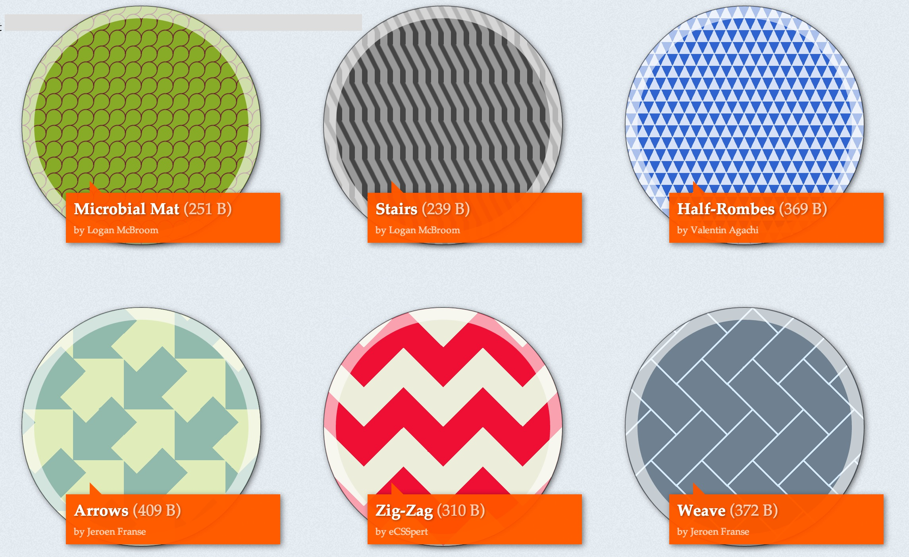

#CSS3背景技术与应用

创意往往蕴含在最简单的东西中，在以往的CSS编码中，用的最多的东西之一莫过于背景技术。背景图片切割，背景图片整合，CSS Sprite技巧等等，在这里这些我们都不讨论。

先来回忆以一下，渐变的背景，各种炫技的背景图片效果等等。往往都是切割大量的图片来实现这些东西。

CSS3在为我们带来大量新属性的同时，并没有忘记`background`属性。其中，上面提到的多背景，渐变等等都不再是难题。

来看一个组效果：


以往这些东西都需要用背景图片的方式来实现，但是今天，我们很幸福，这些东西用CSS提供的背景技术即可实现。

本文不会详述这些东西背后详细的语法，旨在简单的分析一下我们可以用这些新技术做些什么。


上图所示效果中，实际上是由一张图片和一个透明渐变组成。代码很简单：

```css
.gradient-linear-gradient3 {
	background: -webkit-linear-gradient(-30deg,rgba(255,255,255,0),rgba(255,255,255,1)),url(leaves.jpg) no-repeat 0 0;
	background-size: contain;
}
```

注意这里我们同时使用了渐变和背景图片。没错，这也是多背景，每个部分负责处理一部分效果。

实际上，这里有很大一张背景图，然后使用`background-size: contain`属性让这个背景图片等比缩放到适合容器的大小，然后这个背景图将始终被容器包含。

相信单凭这一巧技，在处理背景适应容器的时候就变得容易多了。


在看看这个效果，这里仅仅用到了背景的渐变技术，线性渐变，镜像渐变，半透明形式的渐变。在CSS3中，这些都不在话下。

你一定发现了有一个倒影效果，这个效应效果使用`box-refect`实现的，而且还可以随意的调整大小。如果你在做一个相册类的东西，不妨试试这个属性。

使用上面提到的镜像渐变技术，结合多背景的技巧，这种气泡式的效果也不再是难题啦。

看看国外的达人们，都是如何使用背景技术作出各种炫酷的效果的。



[来源](http://lea.verou.me/css3patterns/)

以下是本期我们实现的demo：

- [CSS3 background属性探索](http://pigrun.github.io/1st_run/demos/pping/demo/demo.html)
- [CSS渐变遮罩](http://pigrun.github.io/1st_run/demos/pping/gradient/gradient-pointer.html)
- [CSS实现记事本效果](http://pigrun.github.io/1st_run/demos/pfhe/notes.html)
